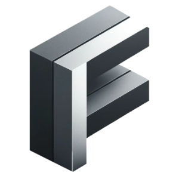

# CodeForms

Forms are simple. And Forms are needed on almost each website and in many webapps.
So you will find tons of paid tools to create Forms and host them on some cloud provider.
All these tools are great. Don´t get me wrong :-)

But what if you have a project where you are searching for a really free solution?

Here we are! CodeForms.



## Open-Source Form Builder and Survey Builder

With CodeForms you can create Forms and Survey with multiple pages. You have a long list of possible inputs.
Also you will be able to define simple or complex conditions between the pages.

So with CodeForms you will have almost all necessary features like other Tools (JotForm, Airtable, Fillout, Tally, Feathery and Co.).
But CodeForms is really free and Open-Source.

## FREE for commercial and personal use

You can use CodeForms with own hosting. The only thing you need is a webhosting (or some other public web storage) where you can put the Form configuration files and deploy the static web app.

Each Form/Survey will be a simple and static JSON file. You can put it anywhere in the web.
Then you can use our App CodeForms.org?url=>>put-your-json-url-here<< and that´s it!

Full Self hosting is also no problem if you want to deploy the frontend on your own server. Simply use the docker container.

## Real privacy for your users

You want to be sure to don´t have trouble GDPR/DSGVO(Europe)?
Since CodeForms is a Single-Page-App without Backend the user will never send any data to us or someone else.
Only the action that you define will be fired directly from the User´s browser.

Great, isn´t it.

## Depoly self-hosted with Docker

If you want to deploy it on your own. Follow these steps:

```
git clone https://github.org/wertania/CodeForms.git
docker build -t CodeForms-local .
docker run -p 8080:80 CodeForms-local
```

## Use locally inside your companies network?

Yes! You can do that. If you deploy your config files locally in your domain CodeForms.org will also work with that-
The only things you need to take care about is that the server for the config have CORS allowed for CodeForms.org.

## Trigger and submit data

You need to define a URL that will be able to recieve a POST from the User´s browser.
That means at the end of the Survey CodeForms will make an POST from the Browser with all data inside.

So you are able to use a lot tools which are able to recieve POST-Webhooks like:

- make.org
- n8n
- zapier
- Node.RED
- Microsoft PowerAutomate
- Your own service!

## Testing

### Test with demo dataset

A demo dataset is included in each installation statically.

```
// plain
/demo/CodeForms.test-config-1.v1.json
/demo/CodeForms.test-config-2.v1.json
// encoded
%2Fdemo%2FCodeForms.test-config-1.v1.json
%2Fdemo%2FCodeForms.test-config-2.v1.json
```

So you call this:

```
https://CodeForms.org?url=%2Fdemo%2Fcodeforms.test-config-1.v1.json
// or
http://localhost:5173/?url=%2Fdemo%2Fcodeforms.test-config-1.v1.json
```

### Get the config from some static storage/webhosting/etc.

You can out the JSON config files for a form on all kinds of internet storage as long as it is available for you app.
That mean you have to take care about the CORS policies and you have to check that your server will reply directly with the JSON file.
E.g. the most Cloud-Drive Providers will not work since the public links do not refer directly to an file. The only open a download page.
That will not work with this app.

### Encoding the URL parameter

If you use this tool dynamically. Then it is important that the URL parameter "url" is encoded.
This can be done by JavaScript like this.

```
const configUrl = 'https://my-self-hosted-server/some/path/CodeForms.test-config.v1.json'
const encodedParameter = encodeURIComponent(configUrl);
const formUrl = `https://CodeForms.io?url=${encodedParameter}`;
```

## Build on the top of a great Open-Source Stack

I was able to develop CodeForms because I could use a great Stack of Open Source Software under the hood.

- SPA: Vue3 + Vite + TypeScript
- UI Components: PrimeVue
- Style: PrimeVue Aura Theme

Thanks a lot for this stuff!

## Planned Features

- Captcha implementation
- Add own images to the radio input
- Deploy the App as a free cloud service
- Evalute the possibilites for an SMTP Gateway
- Simple Node.JS Webserver to serve app and static configurations (will also take configurations by POST) with Dockerfile

## Ideas and contact

If you need professional support you can contact me.
